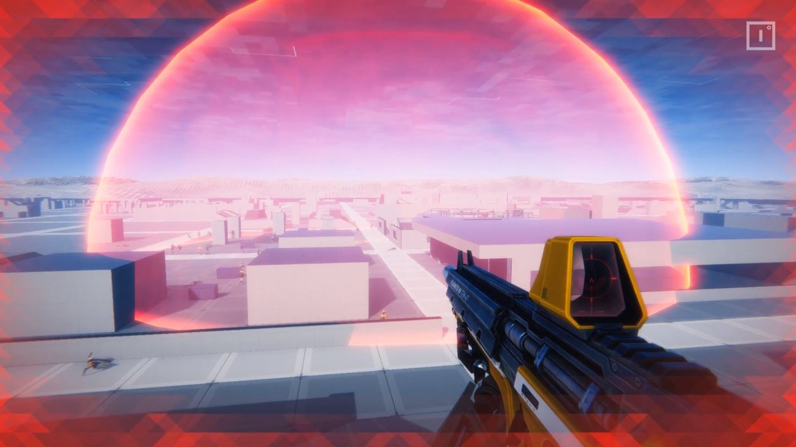

# FPS Starter Project - battle-royale-style "shrinking arena" (of doom!)

A basic version of a battle-royale-style shrinking arena mechanic that damages players or NPCs who are not within the safe zone.

This code was originally written for a [video](https://bit.ly/2yDGcKS) we created for the alpha launch of the GDK. Feel free to develop this further - we can't wait to see what other battle-royale style features you build around it!
