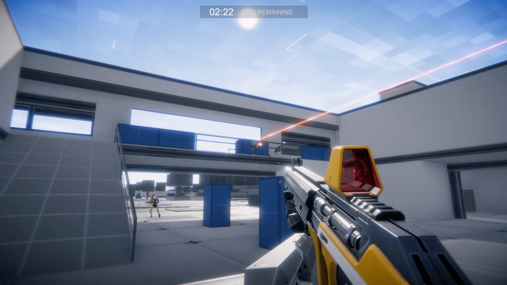

  

  <h1>The SpatialOS GDK for Unity: First-Person Shooter (FPS) Starter Project</h1>

  

    <strong>An example implementation of an FPS game on the <a href="https://github.com/spatialos/gdk-for-unity">SpatialOS GDK for Unity</a></strong>
  

  

    
    
    
  

## About 

### The SpatialOS GDK for Unity

**Note**: The GDK is frozen for users who have not yet migrated their project to SpatialOS running on zeuz. See [github.com/spatialos/gdk-for-unity#readme](github.com/spatialos/gdk-for-unity#readme) for further information.

### The SpatialOS GDK for Unity First-Person Shooter (FPS) Starter Project

The GDK for Unity First-Person Shooter (FPS) Starter Project is an example implementation of an FPS-genre game on top of the [SpatialOS GDK for Unity](https://github.com/spatialos/gdk-for-unity). It features:

* Basic player spawning, movement, and shooting systems.
* An implementation of simulated players for load-testing.
* Variable-sized map generation.

> Note: The FPS Starter Project is _not_ production ready. For example, the shooting and movement systems are client-side authoritative. If you shipped a game based on the FPS Starter Project without hardening these systems, these systems would be vulnerabilities that a bad actor could exploit.

---

* Your access to and use of the Unity Engine is governed by the Unity Engine End User License Agreement. Please ensure that you have agreed to those terms before you access or use the Unity Engine.

&copy; 2021 Improbable
